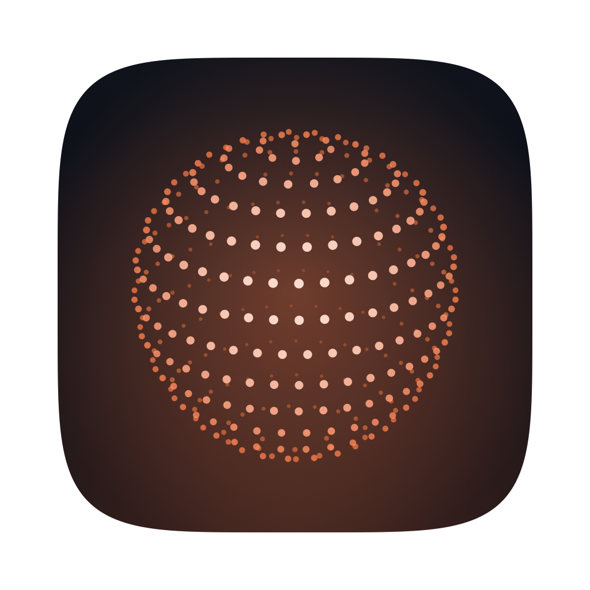

<div align="center">



# Whisper Master

**Local-first streaming dictation for macOS.**
Hold a key, talk, and clean formatted text lands wherever your cursor is — transcribed and cleaned entirely on your own Mac.


[](https://whisper.corkkam.com/eval)
[](https://whispermaster.app)

</div>

---

Whisper Master is a menu-bar app that transcribes your speech with **NVIDIA Parakeet** (via [FluidAudio](https://github.com/FluidInference/FluidAudio)) and cleans it up the way you would actually have typed it — filler words gone, numbers and times formatted, spoken self-corrections resolved — then pastes it into whatever app you are in. An optional on-device language model (qwen2.5-3B via **MLX**) adds a deeper polish, always behind a faithfulness guard, so it only ever *cleans* your words and never answers or acts on them.

**Audio is captured to memory, transcribed, and discarded.** It is never written to a network socket and never written to disk on the normal dictation path. That is the product, not a feature of it.

## What it does

**Dictation** — the core loop, on every build.

- **Streaming transcription while you speak**, on Apple Silicon, with the words appearing in the notch as you talk rather than after you stop.
- **Instant paste, background refine** — the deterministic cleanup pastes immediately and the optional LLM polish lands a beat later, in place, so you never wait on a model.
- **Deterministic cleanup** — filler and stutter removal, inverse text normalization (spoken numbers to digits, currency, percentages, times, emails), spoken **self-correction collapsing** ("twenty no thirty no forty" becomes 40), and a custom-vocabulary glossary.
- **Paste routing per application** — native fields, web views, and terminals each get the mechanism that actually works there.
- **Bluetooth-aware** — it notices when a Bluetooth mic has dropped into call mode and offers a one-tap switch to the built-in mic.
- **Push-to-talk, or hands-free** — hold the key, or double-tap to latch.

**The assistant** — held **fn + control**, a separate key from dictation and deliberately so.

- File a note, set a reminder, ask what is on the calendar. **Notes keep the recording they came from**, alongside the verbatim transcript and the tidied text.
- **Eleven connectors** — Apple, Google, and Exchange calendars, Gmail, Drive, Slack, Notion, Linear, GitHub, Zoom, Asana. Reads are direct; **writes always go behind an approval card** you see first.
- Answers are **spoken back** as well as shown, on the same on-device model.
- **Gentle reminders** surface in the notch band, never in Notification Centre.

**Coding agents in the notch** — a client for [kunai](https://github.com/HEGADE/kunai), never a host.

- When Claude Code needs permission to run something, the band drops with the question and three answers, so you can settle it without going to find the terminal.
- One optional key sends a spoken prompt to a live session; a finished turn opens as a card that renders the markdown real replies are made of.
- If no server is running the surface is simply absent, which is the state on almost every install.

**Traces** — the page that answers "why did it do that": the raw ASR, every cleanup pass and whether it changed anything, the polish verdict including a rewrite the faithfulness guard threw away, where the words were delivered, and which assistant tier took the capture and why the others declined.

**Built to ship** — Developer ID signed, Apple notarized, auto-updating through **Sparkle** across three channels (stable, beta, internal dev), with models streaming from a Cloudflare R2 mirror with resumable downloads, and release notes shown once after an update.

Sign-in is required at first run. It identifies the licence and the beta entitlement; transcription never reaches it.

## How it works

```
 mic  ─▶  Parakeet streaming ASR  ─▶  deterministic cleanup  ─▶  optional on-device LLM  ─▶  paste
                                       · spacing repair            · qwen2.5-3B (MLX)
                                       · self-correction collapse  · faithfulness guard
                                       · inverse text normalization  (falls back to the
                                       · filler removal               deterministic text
                                       · custom vocabulary            whenever it diverges)
```

Transcription and cleanup are separate, testable stages. The deterministic passes are pure Swift — instant, no model. The LLM stage is opt-in and never blocks dictation.

## Evaluation

Every change is graded against the **real shipped pipeline**, not a proxy, on real human speech (LibriSpeech) plus synthetic, noisy, and Bluetooth-mic conditions. It measures word error rate, cleanup quality, and faithfulness, attributes a failure to ASR or to cleanup, and stores each run over time.

| Condition | Word error rate |
|---|---|
| Clean human speech | **3.4%** |
| Bluetooth HFP mic | **16.3%** |
| Noisy environment | **23.5%** |

The weak numbers are published on purpose. **Quote all three or none** — quoting 3.4% alone is the fastest way to lose the trust the whole product rests on.

**Published runs: [whisper.corkkam.com/eval](https://whisper.corkkam.com/eval)**

The harness is in [`eval/`](eval/); the page that publishes the runs lives in the landing-page repo (`app/eval/`, `lib/eval/`) and reads Supabase. Every stable and beta release grades itself and posts its score there.

## Build and develop

**Requirements:** Apple Silicon, macOS 14+, full Xcode 26+ (not just Command Line Tools), and [XcodeGen](https://github.com/yonaskolb/XcodeGen). `project.yml` is the source of truth; the `.xcodeproj` is generated and git-ignored.

```bash
brew install xcodegen rclone
xcodegen generate            # (re)create WhisperMaster.xcodeproj
open WhisperMaster.xcodeproj

swift build                  # fast headless compile check, no .app
swift test                   # unit tests — no models, no audio, no network
swift test --filter AudioReplayTests   # regression bench on real recordings

bash Scripts/install.sh      # build → install to /Applications → relaunch
bash Scripts/bundle.sh       # build + sign the distributable .app
bash Scripts/make-dmg.sh     # package a DMG
```

For UI work, `WM_SNAPSHOT=<dir> .build/debug/WhisperMaster` renders every settings panel and onboarding step to PNGs and exits — seconds instead of a build, sign, install, relaunch cycle. It is compiled out of Release.

## Documentation

| Read this | For |
|---|---|
| [`AGENTS.md`](AGENTS.md) | the working contract: gates, prohibitions, what is in flight |
| [`CLAUDE.md`](CLAUDE.md) | the architecture, in full |
| `Sources/WhisperMaster/*/CLAUDE.md` | the rules that only make sense next to that code |
| [`.claude/skills/releasing/`](.claude/skills/releasing/) | signing, notarization, Sparkle, R2, channels, CI |
| [`.claude/skills/eval-pipeline/`](.claude/skills/eval-pipeline/) | running and reading the eval |
| `../docs/` | features, architecture, design system, monetization, go-to-market |

⚠️ **Never republish a version number.** Each release needs a fresh `CFBundleShortVersionString` — re-shipping one overwrites the bytes its appcast signature was computed for, and Sparkle refuses the update. Bump forward; never re-upload. The rest of the release safety rules are in [`CLAUDE.md`](CLAUDE.md) and the releasing skill.

## Tech stack

Swift · SwiftUI · AppKit · [FluidAudio](https://github.com/FluidInference/FluidAudio) (NVIDIA Parakeet) · [MLX](https://github.com/ml-explore/mlx-swift) (qwen2.5-3B) · [Sparkle](https://sparkle-project.org) · [Clerk](https://clerk.com) · PostHog · Cloudflare R2 · SvelteKit + Prisma + MongoDB (eval dashboard).

---

<div align="center">
<sub>Built for people who would rather talk than type. Everything that matters happens on-device, by design.</sub>
</div>
